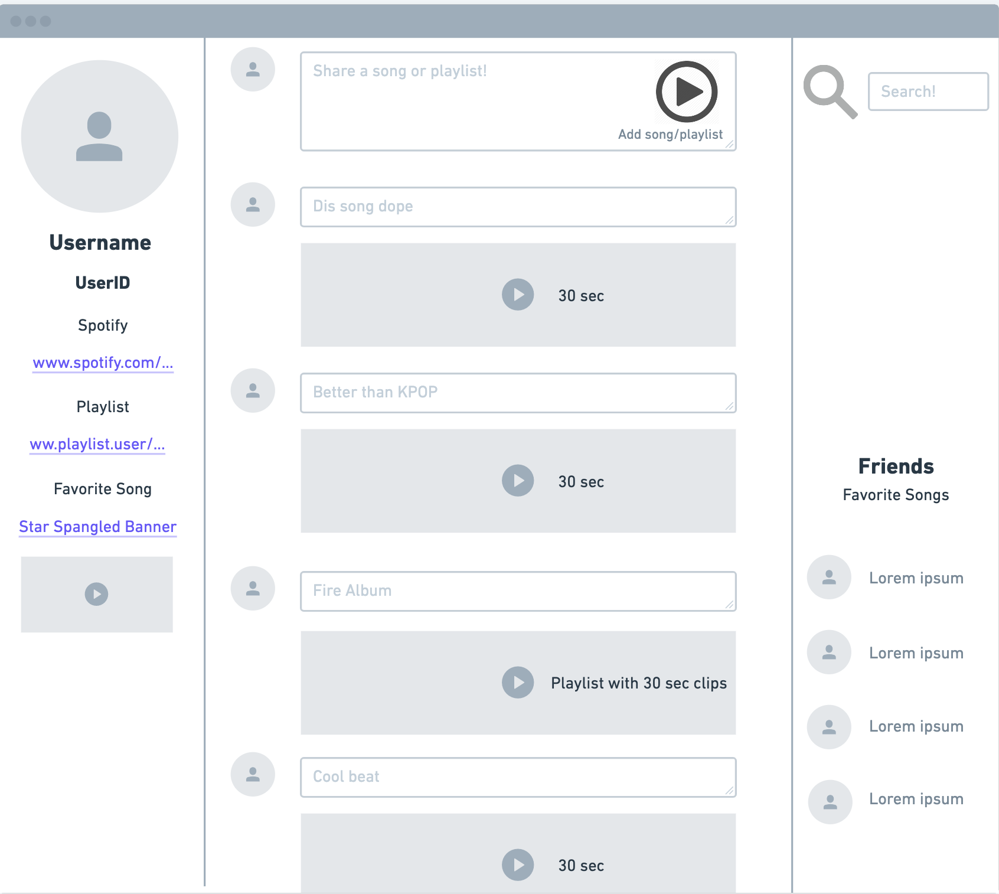
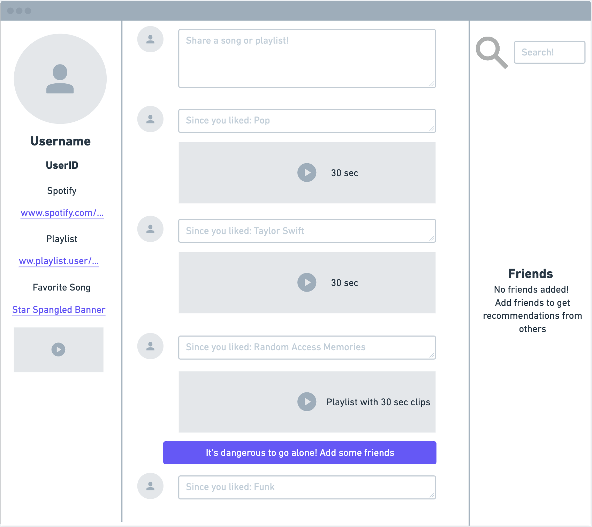
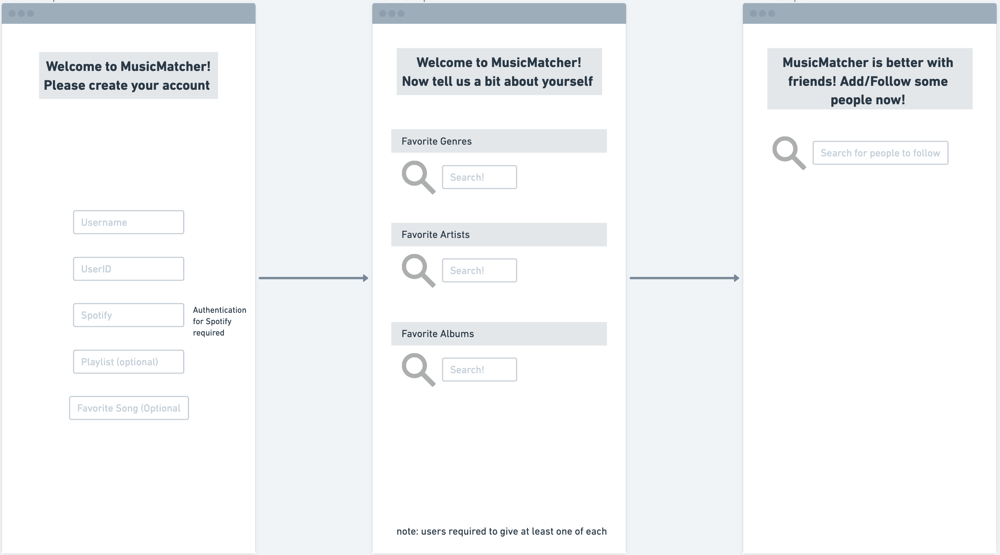
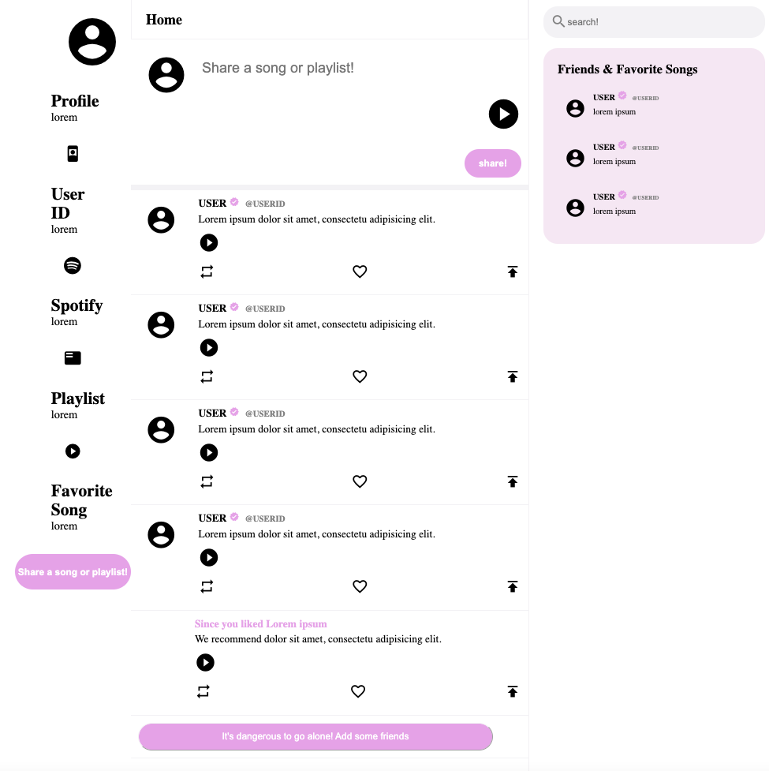

## Data Interactions
Some components of our final project are UIs like user profiles and timelines, a short audio clip feature for recommended songs/playlists, and some commenting/liking features to the recommendations. For the UI component, there will be a user profile interface that contains information like recommended playlist, genre their interested, songs they're playing most at the moment, and many more. Then, we have a timeline feature that shows recommendations from people the user follows, similar to how the Twitter timeline works. Each recommmendation on the timeline will be playable in a short clip, such that users can easily listen to them and decide whether they'd like to continue listening to it on services like Spotify or Apple Music. For the actual music recommendations, it will be similar to posts on instagram. It can include a short clip of the actual song(s), and our project will allow some commenting and liking features for more interactivity between users. Besides these, there will be other components like user authentication and authorization when creating accounts and user profiles. For users with newly created accounts that don't follow anyone else, our service can ask them for music genres they're interested in to recommend some users or songs to them to help them get started.  

# Wireframes

## Mainview

## Mainview with no friends

## User Profile Setup

# HTML/CSS Implementations

## Mainview

# Division of Labor

Stanley Araki: Worked on creating mainview in the wireframe, as well as implementing the mainview in HTML/CSS implementation.
Organized Github structure and added data interactions, wireframe screenshots to this document(doc/milestone1.md).  

Nicholas Chafy: Worked on mainview variations and profile setup in wireframe. Added non-post components to the mainview feed in HTML/CSS Implementation. Implemented the initial account creation html/css.

Joseph Machiaverna: 