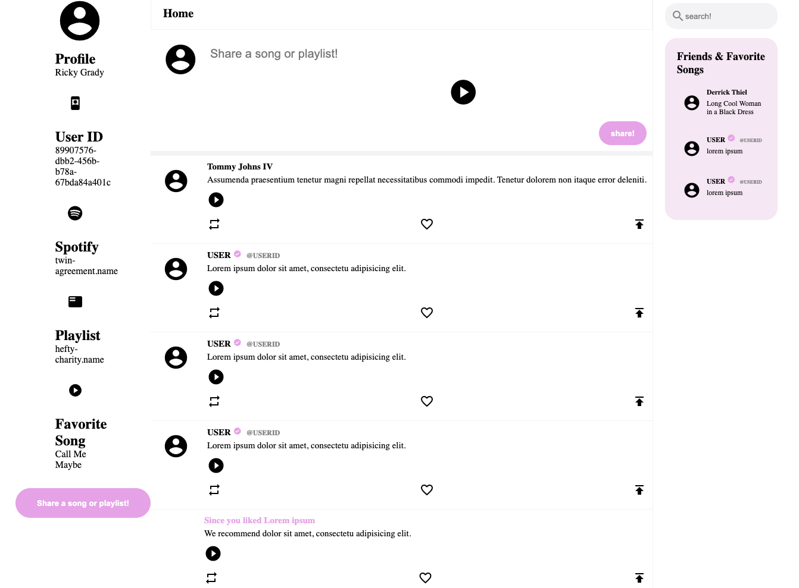

## Create
The Create endpoint provides the ability to create a new profile or chirp using information provided by them and then have it stored. 
Information that will be stored includes things like the username, their favorite song and their friends list for profiles and the text and song names for posts. 
A common use case for this endpoint would be created a new account for the application.
## Read
The Read endpoint provides the ability for the client to read information from a specific database, field, or localStorage. 
Some retreivable information include reading users' playlists, favorite songs, genre, artist, album, friends, and recent updates to their feed.
A common use case for this endpoint may be to retreive all of a user's friends' shared music on their timeline, and then retreiving even more information if a user clicks on the specific shared blurb. 

Example of user information retreived:

{
    "profile": {
        spotify_account: "www.spotify.com/...",
        playlist: "www.playlist.user/...",
        favorite_song: "www.spotify.com/...",
        favorite_genre: "lorem ipsum",
        favorite_artist: "lorem ipsum",
        friends: [
            {
                user_name: "Stanley",
                details: {
                favorite_song: "www.spotify.com/...",
                recent_shared: {
                    ...
                }
            },
            {
                user_name: "Nick",
                details: {
                    ...
                }
            }
        ]
    }
}

## Update
The Update endpoint provides the ability to update an existing entry in the server. The JSON objects to update include either the profile or the chirp object. 
To update, either putProfile or putChrip will be called depending on what needs to be updated. From there, the putJSON function will be called.
It will then look for the id in the desired database and then update the JSON object inside of it. If it is not found, it will create a new one. 
A common use case would be if a user would like to update their favorite song on their profile or they made a typo on their chirp. 

## Delete
The Delete endpoint provides the ability to delete an existing entry in the server. The JSON objects to delete include either the profile or the chirp object.
To delete, either deleteProfile or deleteChirp will be called depending on what needs to be deleted. From there, the deleteJSON function will be called.
It will then look for the id in the desired databased and then delete that object. A common use case would be when a user needs to delete a chirp. 

## Division of Labor 
Joseph Machiaverna: Coded the CREATE endpoint for the API. Also wrote the create, update, and delete descriptions for the description of the 
API.

Stanley Araki: Worked on initial milestone2.md setup, READ API, serving files with Express.js and HTML updates on the client side with data returned from server side endpoints for READ API.

Nick Chafy: Implemented PUT and DELETE server endpoint handling and API, worked on integrating project with heroku with express.js and dependency management. Implemented add friend functionality with HTML updates. 
## Screenshots

This is the update on the main view when the page is first loaded. As we can see, the fields for the profiles are updated upon load of the view. In the future we expect this data to be unique to the user after authentication, and for it to be saved in some sort of database. We can also see one of the user's friends on the right widgets section for "Friends & Favorite Songs". This field is updated with the user's friends' name and favorite song displayed when the view is loaded in, using the READ /profile endpoint. Finally we see the user's feed be updated with the read in 'chirps'(shared music with captions) through the READ /chirp endpoint. 